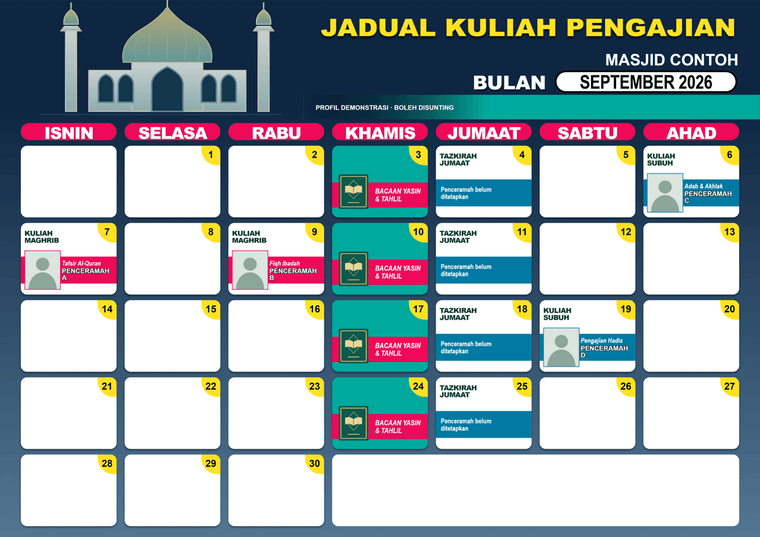
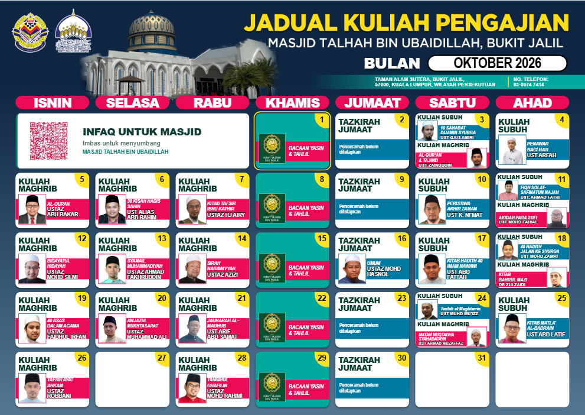

# Jadual Kuliah Generator

**Versi 3.0.0** · Generator poster kuliah untuk masjid dan surau. Buka `jadual-kuliah-generator.html` dalam folder repo, tanpa akaun dan tanpa langganan Adobe. Suntingan jadual berfungsi terus dalam pelayar; eksport PNG/PDF memerlukan internet untuk memuatkan pustaka eksport.

**[Muat turun ZIP](https://github.com/Kengkorok/jadual-kuliah-generator/archive/refs/heads/main.zip)** · [Cara clone](#cara-1-clone-repo) · [English guide](#english)


## Bahasa Melayu

Aplikasi ini ialah `jadual-kuliah-generator.html` bersama `app.css` dan fail JavaScript jirannya. Semua fail itu perlu duduk dalam folder yang sama. Pilih mana-mana cara di bawah, kemudian buka HTML dengan **Microsoft Edge atau Google Chrome**. Tiada pemasangan, akaun atau proses binaan diperlukan.

### Cara 1: Clone repo

Cara ini senang untuk ambil kemas kini bulan berikutnya.

```bash
git clone https://github.com/Kengkorok/jadual-kuliah-generator.git
cd jadual-kuliah-generator
```

Buka `jadual-kuliah-generator.html` dalam Edge atau Chrome. Untuk versi terkini kemudian, jalankan `git pull`.

### Cara 2: Muat turun ZIP

1. Tekan **Code → Download ZIP** pada halaman repo, atau guna pautan [Muat turun ZIP](https://github.com/Kengkorok/jadual-kuliah-generator/archive/refs/heads/main.zip).
2. Ekstrak ZIP tersebut. Jangan asingkan `jadual-kuliah-generator.html` daripada `app.css`, `app-core.js`, `app-ui.js`, `profile.js` dan `app-init.js`.
3. Buka `jadual-kuliah-generator.html` dalam Edge atau Chrome.

### Contoh pratonton

| Jadual contoh (nama generik) | Contoh masjid sebenar |
| --- | --- |
|  |  |

### Mula dalam beberapa langkah

1. Buka **Tetapan poster**. Isi nama masjid atau surau, tajuk poster, alamat dan telefon. Muat naik logo serta gambar masjid jika ada. Ilustrasi masjid umum digunakan jika gambar belum dimuat naik.
2. Buka **Urus senarai** di sebelah pilihan penceramah untuk menyimpan nama, kitab dan gambar yang kerap digunakan.
3. Buka **Aturan berulang**. Pilih hari dan kejadian pertama hingga kelima, atau **Setiap minggu**. Contohnya, Maghrib pada Isnin ketiga. Nama penceramah boleh dikosongkan untuk sesi yang belum ditetapkan.
4. Tekan **Terapkan pada bulan ini**. Bulan baru menggunakan aturan terkini secara automatik. Tarikh yang sudah disunting secara manual dikekalkan ketika aturan diterapkan.
5. Klik petak tarikh untuk menyunting kuliah, kitab, gambar atau menambah acara bagi bulan itu sahaja.
6. Jika diperlukan, buka **QR & ruang infaq**, muat naik QR masjid sendiri, isi nama penerima dan aktifkan paparannya.
7. Semak poster, pilih A3 atau A4, kemudian muat turun PNG atau PDF.

**Cuba contoh** menambah profil demonstrasi berasingan, dengan nama “Penceramah A–D” dan gambar siluet. Tiada penceramah, logo atau QR bank masjid tertentu disertakan sebagai tetapan awal.

### Profil yang berasingan

- **+ Profil baru** mencipta jadual kosong untuk masjid atau surau lain.
- Setiap profil mempunyai identiti, gambar, warna, penceramah, aturan berulang, QR dan koleksi bulan sendiri.
- Menukar profil tidak menukar data profil lain. Semua data disimpan pada pelayar/peranti yang digunakan.
- Menyunting senarai penceramah tidak mengubah kuliah atau aturan yang sudah disimpan. Pilih penceramah semula pada aturan atau tarikh untuk menggunakan maklumat terbarunya.
- **Padam profil ini** meminta pengesahan dan membuang profil daripada simpanan peranti. Sandarkan data dahulu jika diperlukan.

### Aturan, tarikh dan acara

“Isnin ketiga” ialah Isnin yang ketiga dalam bulan, bukan baris ketiga kalendar. Aturan kelima dilangkau jika bulan itu tiada kejadian kelima. Setiap tarikh menyokong maksimum dua sesi; aturan yang bertindih melebihi had ditolak.

**Terapkan aturan** mengemas kini tarikh yang belum disunting. Semua sesi pada tarikh yang sudah disunting, dipadam atau mempunyai acara dikekalkan. **Pulihkan ikut aturan tarikh ini** membuang pengecualian pada tarikh tersebut. **Jana semula bulan** menggantikan seluruh bulan selepas pengesahan. Bulan lain tidak berubah.

Acara boleh memenuhi petak atau berkongsi dengan satu kuliah di bawahnya. Gambar penceramah boleh dilaraskan dari segi crop, zum dan kedudukan. Saiz tulisan kuliah juga boleh dilaraskan. Sesi tersuai boleh ditaip dan warnanya ditukar melalui Tetapan poster.

### QR dan ruang infaq

QR dimatikan pada profil baru. Muat naik QR dalam format PNG, JPG atau WebP. Gambar QR asal dikekalkan tanpa potongan atau pemampatan semula.

Secara automatik, QR muncul sekali di ruang **tanpa haribulan** paling luas, sekurang-kurangnya dua petak. Jika dua ruang sama luas, ruang di hujung bulan diutamakan. Petak bertarikh tidak digantikan walaupun tiada kuliah.

Jika ruang tidak mencukupi, aplikasi menggunakan jalur bawah. Pilihan lain ialah menyembunyikan QR untuk bulan itu, atau sentiasa menggunakan jalur bawah. Tajuk, ayat ringkas, nama penerima dan QR disimpan mengikut profil.

### Simpanan dan sandaran

- Tekan butang **Simpan** dalam borang untuk menyimpan perubahan. Suntingan yang belum disimpan tidak dimasukkan dalam eksport atau sandaran.
- **Simpan Data** memuat turun satu profil bersama semua bulannya, aturan, penceramah dan gambar.
- **Sandarkan semua profil** menghasilkan satu fail JSON yang merangkumi semuanya.
- **Buka Data** menambah profil sebagai salinan baru; profil sedia ada tidak digantikan. Fail JSON satu bulan daripada generator lama juga boleh diimport sebagai profil baru.
- Fail HTML **tidak berubah** apabila anda menyunting. Sebelum berpindah lokasi fail, pelayar atau peranti, gunakan Simpan Data, kemudian Buka Data di lokasi baru.
- Simpanan pelayar mempunyai had. Jika penuh atau tidak tersedia, mesej dipaparkan; data yang masih terbuka boleh dimuat turun melalui Simpan Data.
- Edisi Talhah menggunakan simpanan berasingan. Sandaran Talhah dengan rujukan grafik terbina dalam perlu dibuka menggunakan HTML edisi Talhah yang disimpan berasingan.

### Eksport

| Format | A3 landskap | A4 landskap |
| --- | --- | --- |
| PNG, 300 dpi | 4961 × 3508 px | 3508 × 2480 px |
| PDF | 420 × 297 mm | 297 × 210 mm |

PDF mengandungi imej poster resolusi tinggi. Kualiti potret bergantung pada gambar sumber. Fon menggunakan Arial, Arial Narrow dan Arial Black jika tersedia; rupa huruf boleh berbeza mengikut peranti. Teks terlalu panjang ditandakan dan perlu dipendekkan sebelum eksport.

### Pengesahan dan pembangunan

Disemak pada Windows dengan Edge dan Chrome: pengasingan profil, aturan mingguan/kejadian tertentu, pengecualian bulanan, import/eksport data, QR mengikut profil, susunan mudah alih, kegagalan storan dan eksport PNG/PDF A3/A4. Semakan kalendar meliputi 2026–2030 dalam mod biasa serta padat. Eksport menggunakan pustaka dari CDN. Firefox dan Safari belum diuji.

Aplikasi diedarkan sebagai satu HTML. Untuk menjalankan semakan pembangunan: pasang Node.js, jalankan `npm install`, kemudian `npm test` dengan Edge dan Chrome tersedia. `TEST_BROWSERS` boleh mengehadkan pelayar, contohnya `msedge`. Tiada Node.js diperlukan oleh pengguna aplikasi.

## English

**Version 3.0.0** is a monthly lecture poster generator for any mosque or surau. The application is `jadual-kuliah-generator.html` together with `app.css` and its neighbouring JavaScript files; keep them in one folder. Editing and saved data work in the browser; PNG/PDF export loads html2canvas and jsPDF from a CDN. No Adobe account or build process is needed.

### Getting the files

**Option 1 — clone the repository** (easiest to keep updated):

```bash
git clone https://github.com/Kengkorok/jadual-kuliah-generator.git
cd jadual-kuliah-generator
```

Open `jadual-kuliah-generator.html` in Edge or Chrome, and run `git pull` for later updates.

**Option 2 — download the ZIP**: use **Code → Download ZIP** on the repository page, or this [ZIP download link](https://github.com/Kengkorok/jadual-kuliah-generator/archive/refs/heads/main.zip). Extract everything, keep the HTML beside `app.css` and the JavaScript files, then open the HTML.

### Preview

| Generic example (placeholder names) | Real mosque example |
| --- | --- |
|  |  |

Start with a blank profile or use **Cuba contoh** for a separate demonstration profile. Set the mosque name, poster heading, address, logo, building photo and colors in **Tetapan poster**. Each profile has independent speakers, recurring rules, donations and monthly schedules. Bundled defaults stay generic — no institution-specific bank QR, portraits or logos are preloaded. The `docs/` screenshots above are documentation only and do show a real mosque example.

Add speakers through **Urus senarai** and configure **Aturan berulang** by weekday and first through fifth occurrence, or every week. Fifth occurrences are skipped when absent. At most two sessions can share a date; conflicting rules are rejected. Applying rules preserves manually edited dates, including deleted sessions and events. Newly opened months use the current rules; existing months change only when explicitly updated. Resetting a date or regenerating a month requires confirmation. Library edits affect future selections, not saved sessions.

Click a date to edit its sessions or add an event image. Events can fill a cell or share it with one lecture. Photos support crop, zoom and vertical positioning. Custom session types and colors are supported.

The donation panel is off by default. Upload your own QR without recompression, then enable it through **QR & ruang infaq**. It appears once in the largest undated span of at least two columns, preferring the trailing span when tied. A footer is available when space is insufficient. You can also hide it for such months or always use the footer. Dated cells are never replaced.

**Simpan Data** exports the current profile, including every month and uploaded image. **Sandarkan semua profil** exports the whole workspace. **Buka Data** imports copies without replacing existing profiles; older single-month JSON files can also be imported. Talhah-edition backups that refer to its bundled artwork belong in the separate Talhah HTML.

Browser storage is local to the browser and file/origin. The HTML itself does not change when edited. Export JSON before moving to another location or device. Storage failures are shown while keeping the current data available for backup. Save open forms before exporting.

PNG exports use A3 4961 × 3508 or A4 3508 × 2480 at 300 dpi. Raster PDF exports use A3 420 × 297 mm or A4 297 × 210 mm. Source image resolution and available system fonts affect the result. Text overflow is flagged before export.

Validated on Windows Edge and Chrome. Firefox and Safari have not been tested. Development checks: install Node.js, run `npm install`, then `npm test`. The application itself needs no runtime installation; keep `jadual-kuliah-generator.html`, `app.css` and the JavaScript files together.

## Licence

GNU GPL v3 — see [LICENSE](LICENSE). Export libraries: html2canvas 1.4.1 and jsPDF 2.5.1 are loaded from jsDelivr. Generic mosque/book illustrations and demonstration silhouettes are included in this project. User-uploaded images remain the supplied material. Screenshots in `docs/` are documentation; the Masjid Talhah preview shows the author's own mosque, including its published contact number and donation QR, and is not loaded as a default profile.
